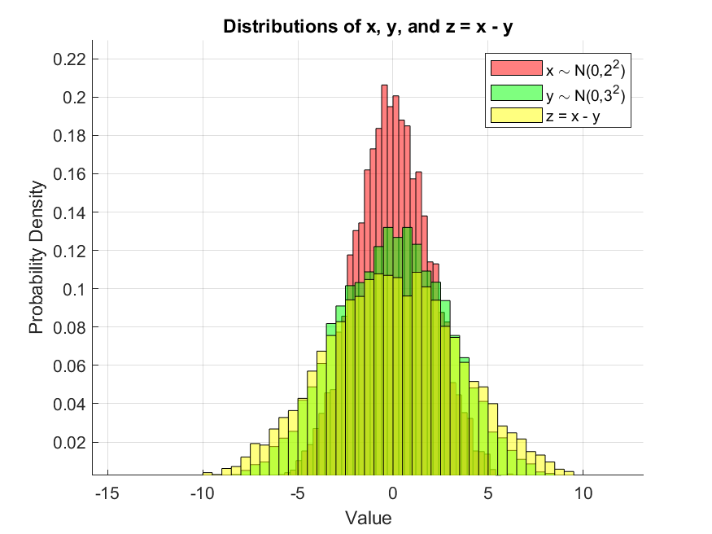

# Gaussian Distribution Simulation for Navigation Systems

This MATLAB script demonstrates how two independent Gaussian random variables behave when combined or subtracted.  
It connects a simple probability concept with real-world **sensor fusion** and **navigation filter design** (e.g., GPS/INS integration).

---

## 🎯 1. What Each Color Means

**Red (x):** random variable x ~ N(0, 2²)  
→ mean μx = 0, standard deviation σx = 2

**Green (y):** random variable y ~ N(0, 3²)  
→ mean μy = 0, standard deviation σy = 3

**Yellow (z = x − y):** represents the difference between two independent Gaussian variables.

---

## 📘 2. Theoretical Properties of z = x - y

If x and y are independent and Gaussian:

z = x - y ~ N(μx - μy, σx² + σy²)

Plugging in your values:

μz = 0 - 0 = 0  
σz = sqrt(2² + 3²) = sqrt(13) ≈ 3.606

So, z is also Gaussian, but wider (more spread out) than both x and y.

---

## 🛰️ 3. Relevance to Navigation Systems

In navigation (GPS/INS, radar, star sensor fusion, etc.):

- Each measurement or sensor reading has **Gaussian noise** (uncertainty).  
- When two uncertain quantities are **combined or subtracted**, their variances **add up**.  
- This is exactly how **Kalman filters** update uncertainty:

P_combined = P₁ + P₂

**Example:**  
- GPS position error: σ = 3 m  
- IMU drift error: σ = 5 m  
→ Combined uncertainty: sqrt(3² + 5²) = 5.83 m

The same principle is shown in this simulation — combining random processes leads to **larger uncertainty** (wider Gaussian).

---

## 📈 4. Result Visualization



- **Red:** x ~ N(0, 2²) → narrow  
- **Green:** y ~ N(0, 3²) → wider  
- **Yellow:** z = x - y → widest (uncertainty grows)

---

## 💻 5. Run the Code

1. Clone the repository:
   ```bash
   git clone https://github.com/<your-username>/Gaussian_Distribution_Navigation.git
